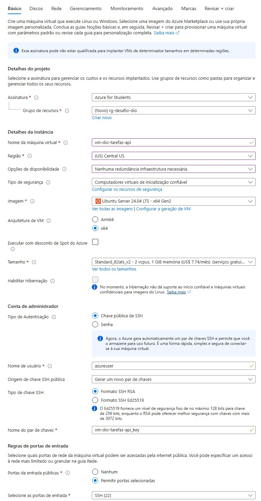
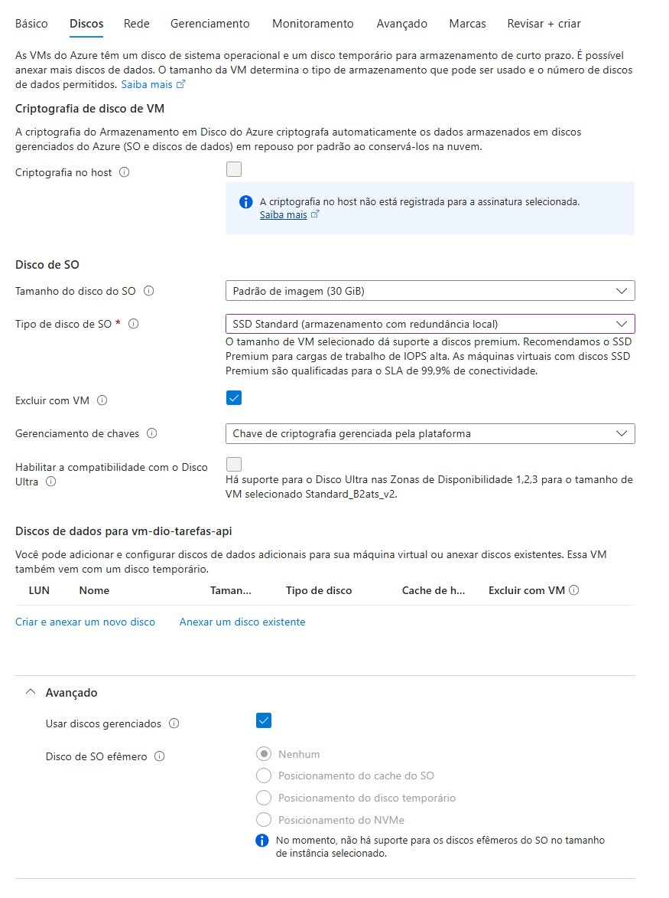
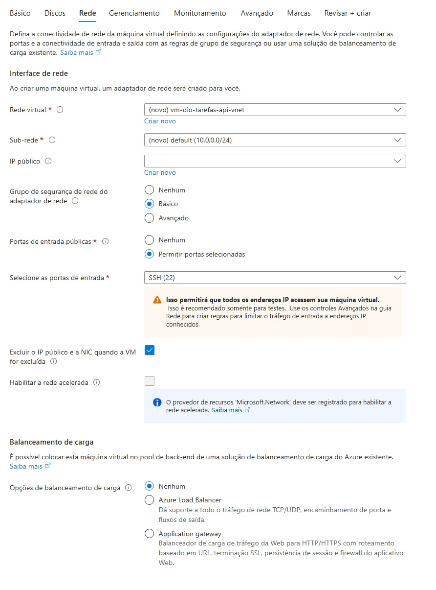
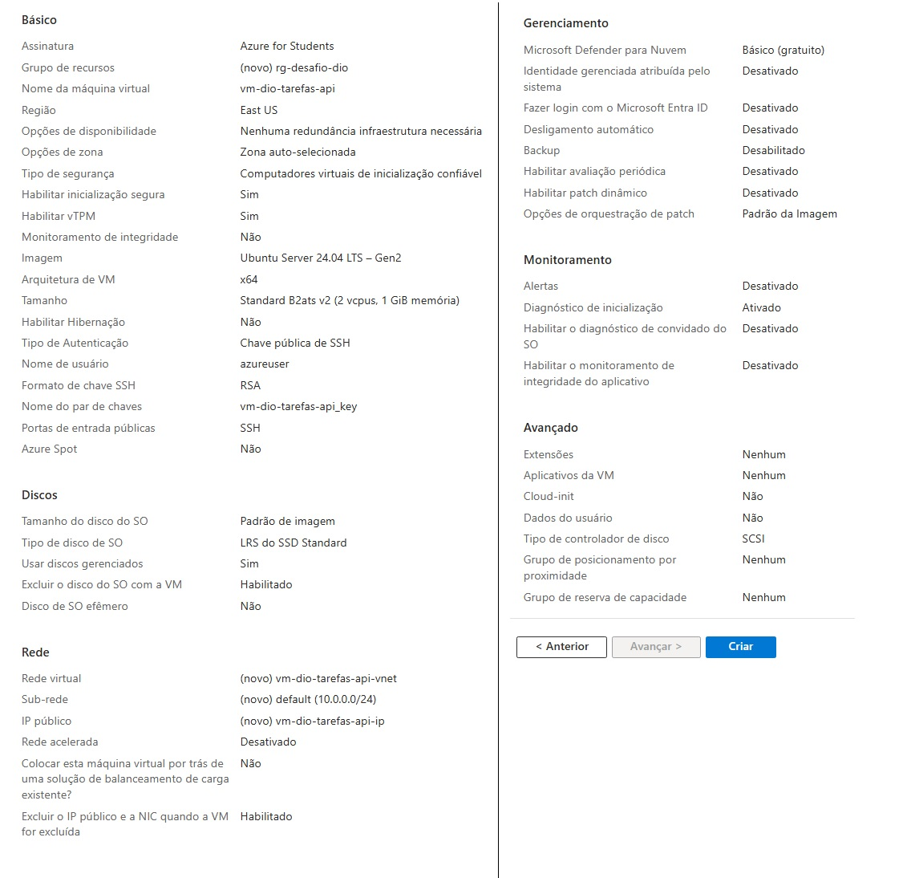
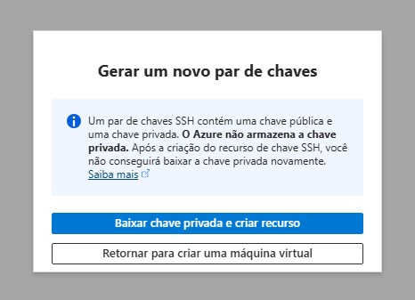
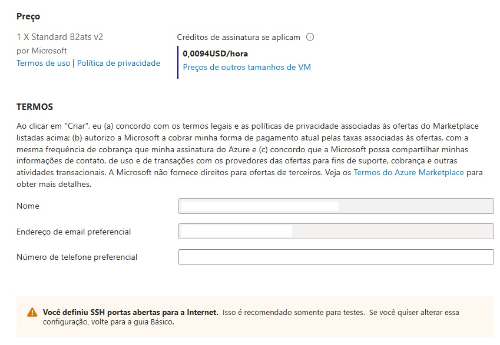
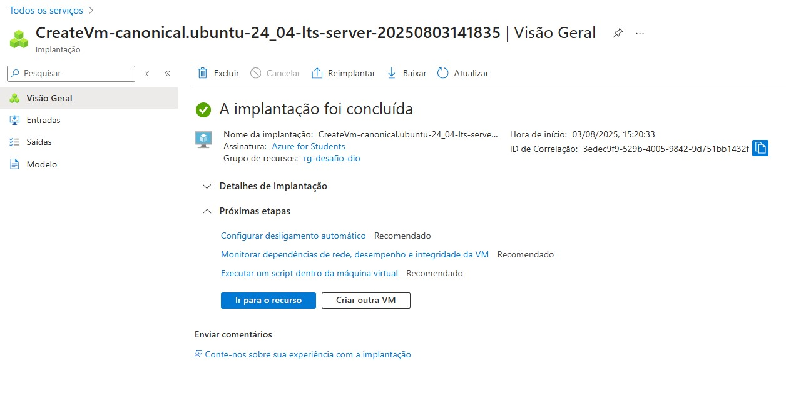
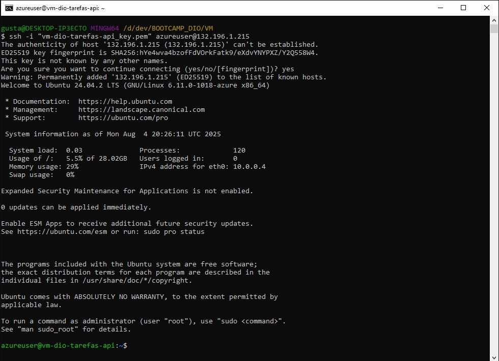

# 🖥️ Desafio de Projeto: Provisionando Infraestrutura na Azure

Este repositório documenta a criação da infraestrutura de computação **(IaaS)** que serve como base para uma **API .NET completa, containerizada com Docker e com deploy realizado na nuvem Microsoft Azure.**

O objetivo deste desafio do **Bootcamp .NET da DIO/GFT** foi aplicar os conhecimentos de nuvem de forma prática. No entanto, a criação desta VM foi apenas o primeiro passo de um projeto muito maior e mais integrado.

 ## 🚀 **O projeto final, com a API online, arquitetura detalhada e todo o código-fonte, está no repositório principal:**
 - ### [➡️ Clique aqui para ver a Solução Completa](https://github.com/GustavoHerreira/task-management-api)

---

## 🛠️ Arquitetura da Infraestrutura (VM)

A Máquina Virtual foi provisionada com foco em três pilares: **Segurança, Custo-Benefício e Escalabilidade Futura**.

| Pilar | Decisão Técnica | Justificativa |
| :--- | :--- | :--- |
| 🛡️ **Segurança** | **Inicialização Confiável** & **Chaves SSH** | Utilização do padrão de segurança moderno da Azure e o método de autenticação mais seguro para servidores Linux. |
| 💰 **Custo-Benefício** | **Região `Central US`** & **VM `B2ats_v2`** | Escolha de uma região com menor custo e uma VM da série B (expansível), aproveitando a oferta de serviços gratuitos para máxima eficiência de custos. |
| 🔗 **Conectividade** | **Network Security Group (NSG)** | Acesso inicial configurado via firewall (NSG) apenas para a porta SSH (22), garantindo que o servidor não fique desnecessariamente exposto. |

---

## ✅ Prova de Execução: Screenshots do Processo

A seguir, a documentação visual do provisionamento da Máquina Virtual no Portal Azure.

#### 1. Configurações Básicas
*Define a identidade, localização e poder de computação da VM.*

#### 2. Configurações de Disco
*Detalhes do disco do sistema operacional, com a opção "Excluir com VM" marcada para otimização de custos.*

#### 3. Configurações de Rede e Firewall Inicial
*Criação da VNet e configuração do Grupo de Segurança de Rede (NSG) para permitir o acesso SSH.*

#### 4. Validação das Configurações
*Resumo completo de todas as configurações antes da criação do recurso.*

#### 5. Geração e Download da Chave de Acesso
*Pop-up para download da chave privada SSH, essencial para o acesso seguro à VM.*

#### 6. Confirmação de Custo
*Tela final exibindo o custo por hora da máquina, demonstrando o modelo Pay-As-You-Go.*

#### 7. Implantação Concluída
*Confirmação do Portal Azure de que todos os recursos foram criados com sucesso.*

#### 8. Primeiro Acesso Remoto via SSH
*Prova final do acesso bem-sucedido ao terminal da VM, confirmando que a infraestrutura está 100% online e acessível.*

> **Observação sobre Boas Práticas de Segurança:**
> Para fins didáticos e de documentação, o endereço de IP público do servidor está exposto no screenshot acima. Em um cenário corporativo real, esta não seria uma prática recomendada. O acesso administrativo (SSH) seria protegido por medidas adicionais, como o uso de um *Bastion Host* (ferramenta mencionada pela instrutora durante o Bootcamp) e regras de firewall que restringem o acesso apenas a IPs de origem confiáveis.
---

## 👉 Próximo Passo: A Evolução para uma Arquitetura Serverless

A criação desta Máquina Virtual foi a **fundação original** do projeto, cumprindo os requisitos do desafio com uma arquitetura IaaS (Infraestrutura como Serviço). Este foi o ambiente onde a primeira versão da API foi implantada e validada.

No entanto, o projeto evoluiu. Em busca de maior eficiência, escalabilidade e otimização de custos, a aplicação **migrou desta VM para uma plataforma moderna e serverless: o Azure Container Apps (ACA)**.

Para entender a jornada completa e ver a arquitetura final, visite o repositório principal. Lá você encontrará:

* A nova arquitetura detalhada com **`Azure Container Apps`**.
* O código-fonte completo da API .NET.
* A história documentada da migração, que teve esta VM como ponto de partida.

**Visite o repositório principal para ver a solução final e a API em produção!**

### [➡️ Ver o Projeto Completo (Nova Arquitetura com Azure Container Apps)](https://github.com/GustavoHerreira/task-management-api)
